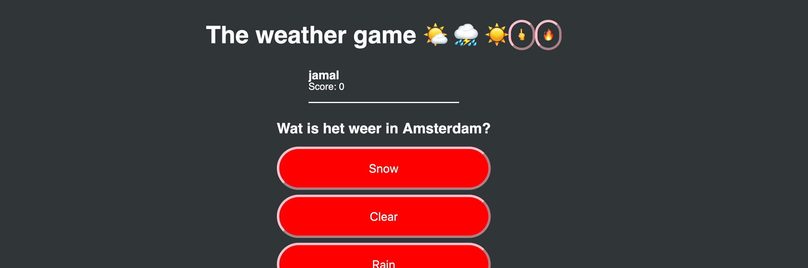
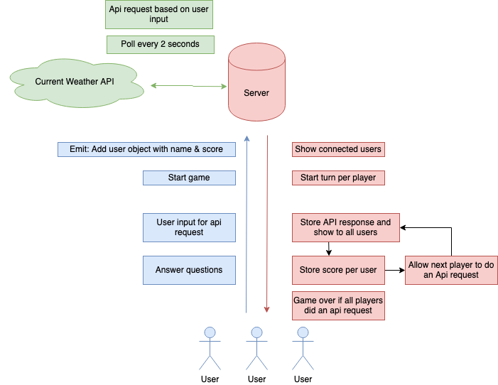

# The weather game 
Real-Time Web @cmda-minor-web · 2018-2019
Author: Jamal van Rooijen

[rubric]: https://docs.google.com/spreadsheets/d/e/2PACX-1vSd1I4ma8R5mtVMyrbp6PA2qEInWiOialK9Fr2orD3afUBqOyvTg_JaQZ6-P4YGURI-eA7PoHT8TRge/pubhtml

Altijd al afgevraagd wat het weer is in welke stad dan ook ter wereld? Daar kan je nu achter komen terwijl je een spelletje speelt haha.

Het concept is dat je met je vrienden het weer kan opvragen en daarbij moet raden welk weer het is. Iedereen mag één keer het weer opvragen. Wanneer iedereen aan de beurt is geweest, stopt het spel en is er een winnaar. Het opgevraagde weer wordt real-time bijgehouden en het goede antwoord zal daarmee ook veranderen.

[Link naar demo](https://the-weather-game.herokuapp.com/)

## Data life cycle
Het data model is vrij simpel. Het meest interessante wat er gebeurd is dat elke gebruiker een keer het API request kan manipuleren met zijn wensen, waarna die ook wordt doorgestuurd naar de andere spelers. Door de beurten de koppelen aan de `socket.id` kunnen we elke speler die meedoet langsgaan.

--- 

## API
Ik maak gebruik van de [Open Weather API](https://openweathermap.org/api). Een simpele weer API waar ik meteen het weer kan ophalen van de stad waar ik naar vraag.

### Authentication
Je kan je aanmelden met een persoonlijke API key. Deze krijg je automatisch wanneer je een account aanmaakt. Met een gratis account kan je de maximaal `60 requests` per minuut doen.

---

## Process: The requirements
### Game steps
1. Create initial room for players to join
2. Create user with nickname and personal ID
3. Statemanagement
   1. Start the game. At this point no new users can join.
4. Give a random player the option to press the button
   1. When the button is pressed: Select a random city from an array of cities
   2. Weather and country is fetched.
      1. Location is broadcasted to all players.
      2. Every player has 10 seconds to guess the weather. There are limited options available.
      3. After 10 seconds, the players with the right answers earn points. If you guessed wrong, you have to drink.
      4. After 10 turns the game is over and a winner is chosen by the amount of points. The loser has to drink a whole beer.

---

### Data needed
#### User
- ID / User name
- Score
- Number of players

#### Each turn
- API: City name -> broadcast to players
- API: Weather current city -> hidden
- Per player:
  - If someone answered
  - Answer speed
  - Correct / wrong answer
  - Adding points to right players
- When everybody gave an answer
  - Finish turn
  - Broadcast weather conditions to players
  - Give points

#### Game state
- If a game is started
- If a game is finished
  - If finished, players can enter the roooooom
- Count turns played until 10 -> finish

### API
1. Create semi-static base
2. Define socket.io use cases
3. Add gameplay
4. Get weather API
   1. Poll data every x seconds

### Socket logic
1. Creating a new user: Socket.io -> connection + disconnect
2. Register a user + nickname
3. Button which starts the game -> broadcast/emit to all players
4. Store data in memory (maybe later to a DB)

---